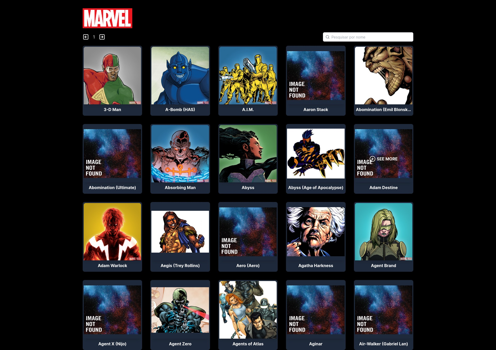
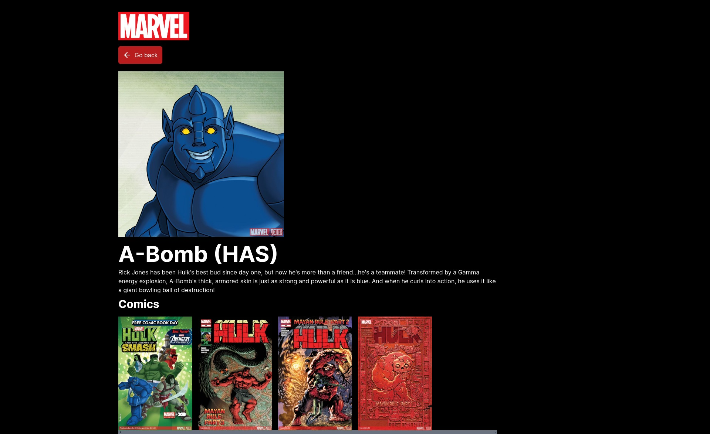

# Teste Dinheirow

## Desafio Marvel
Crie um aplicativo front-end conectado ao back-end Marvel desenvolvido usando dados e rotas obtidos pela API oficial da Marvel Comics.

API DOCS: https://developer.marvel.com/docs

### 💻 Requisitos

- A aplicação deverá conter uma página inicial com uma listagem de personagens com paginação e deverá possuir um filtro que busca os dados pelo nome do personagem.
- Ao clicar em um personagem deverá ser exibida a página do personagem com detalhes (nome, descrição e as fotos dos quadrinhos)
- Na página do personagem deverá conter um botão que volta para página inicial de listagem dos personangens
- Ao voltar para a página da listagem dos personagens o filtro que busca o nome dos dados e a página da listagem deverão ser o mesmo que estavam antes do usuário entrar na página de detalhes do personagem.
- caso o personagem não tenha foto deverá ser colocada uma foto do lotipo da Marvel.
(atenção: não será permitido colocar essa validação nos componentes visuais)
- caso o personagem não tenha descrição exbir o texto "descrição não informada". 
(atenção: não será permitido colocar essa validação nos componentes visuais)

### Critérios de avaliação
Além dos requisitos levantados acima, iremos avaliar os seguintes critérios:
  - gerenciamento de estado
  - componentização
  - responsividade
  - testes
  - Ui design

### Tecnologias Obrigatórias
 - NextJs
 - Typescript
 - tailwind css

### Tecnologias opcionais 
 - redux,
 - react query,
 - redux tookit
 - jest
 - testing library

### Difencial
 - Ui design agradável
 - conhecimento de Atomic Design 
 - conhecimento de clean archtecture
 - testes automatizados

 ## RESULTADO

 ### Home

## Detalhes

